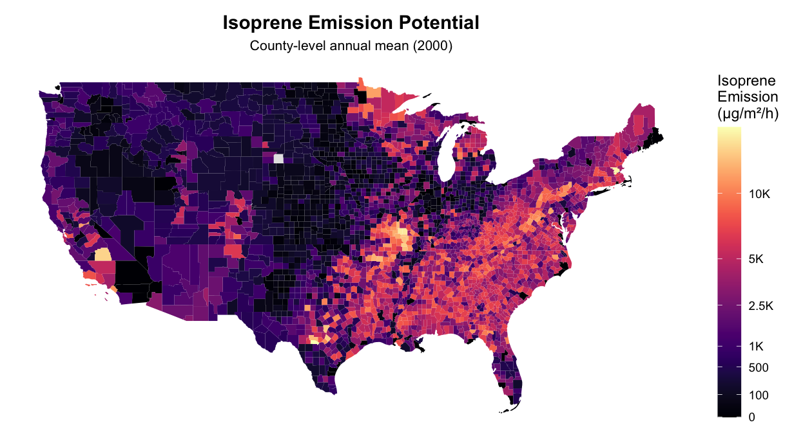
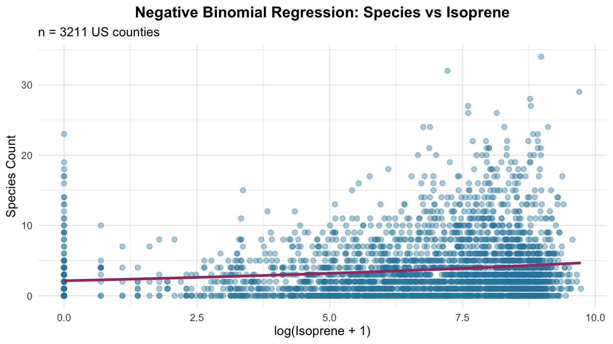

# Assessing the Relationship Between Isoprene Emissions and Invasive Species in the United States

## Project Overview
This project investigates the potential relationship between biogenic isoprene emissions and invasive forest insect species occurrences across counties in the United States for the year 2000. By combining MEGAN EMEP-Isoprene-EP modeled isoprene fluxes with county-level invasive species data from the Alien Forest Pest Explorer, we assess whether higher isoprene emissions correlate with higher invasive species richness.

**Research Question:**  
Does the level of isoprene BVOC emissions influence the number of invasive plant and insect species observed across regions in the United States?

**Hypotheses:**  
- **Null (H₀):** Isoprene BVOC emissions have no effect on invasive species occurrences.  
- **Alternative (H₁):** Isoprene BVOC emissions significantly affect invasive species occurrences.  

---

## R Workflow

### 1. Data Preparation
- Imported county-level invasive species counts from AFPE.  
- Imported MEGAN EMEP-Isoprene-EP NetCDF files to extract isoprene emission fluxes at 0.25° × 0.25° resolution.  
- Aggregated emissions data to the county level.  
- Merged invasive species counts with emission fluxes for analysis.

### 2. Exploratory Analysis
- **Species richness** distribution across counties visualized in **Rplot01**.  
- **Isoprene emissions potential** visualized spatially in **Rplot02**.  

### 3. Statistical Analysis
- Conducted **Negative Binomial Regression** to model invasive species counts as a function of isoprene emissions.  
  - Chosen to account for overdispersion in count data.  
  - Regression results are shown in **Rplot03**.

---

## Outputs

### 1. Species Richness Map
Distribution of invasive forest insect species counts across U.S. counties.  


---

### 2. Isoprene Emissions Potential Map
County-level isoprene emission fluxes aggregated from MEGAN EMEP-Isoprene-EP.  



---

### 3. Negative Binomial Regression
Relationship between isoprene emissions and invasive species counts with fitted regression line.  



---

## How to Run the R Script
1. Install required R packages:  
```r
install.packages(c("tidyverse", "sf", "raster", "sp", "MASS", "ggplot2", "viridis"))
2. Place MEGAN NetCDF files and AFPE data in your working directory.

3. Run the analysis:
```r
source("isoprene_invasive_analysis.R")

---
## Notes
Data covers the year 2000.
Invasive species counts include forest insect species only.
County-level aggregation may introduce minor spatial approximation errors.
Negative binomial regression was selected due to overdispersion in species count data; Poisson regression was tested but showed poor fit.
